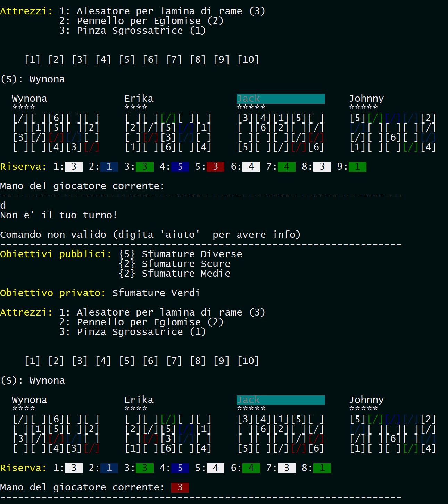
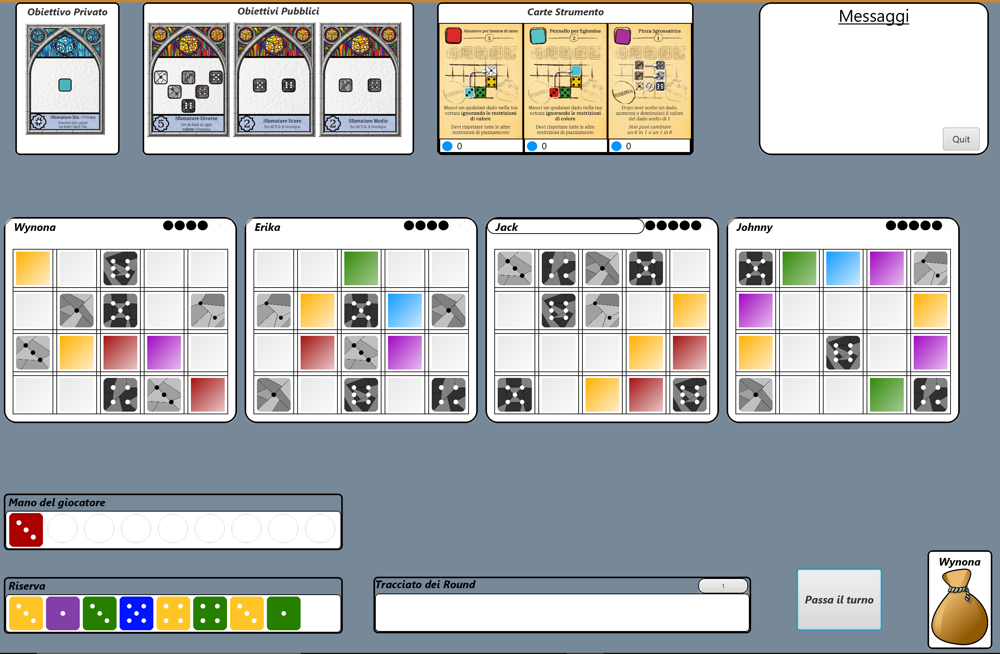

# Sagrada

Software version of the boardgame [Sagrada](https://floodgate.games/collections/games/products/sagrada) developed in Java for the Software Engineering course during the academic year 2017/2018.

The UML diagrams and the documentation is in the folder "Deliverables".

CLI View:

GUI View:

